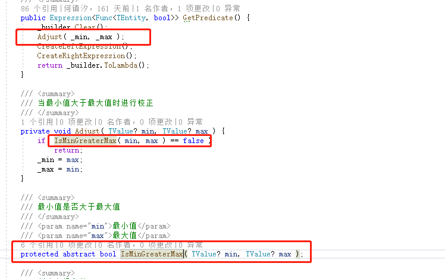
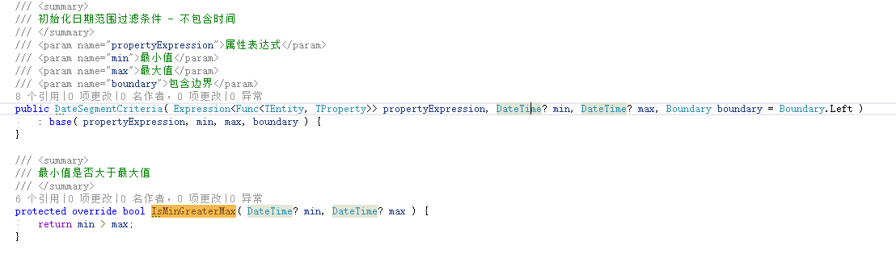
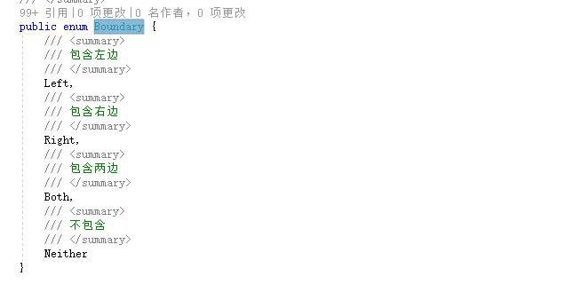
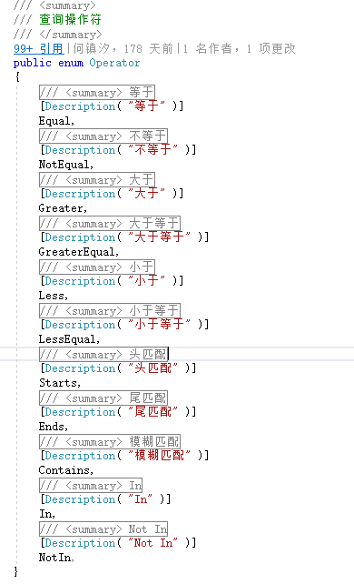

#Util核心类库

##这个目录下的文件主要是应用的基础类

###定义了应用的DTO:

#####   Dto应当继承自RequestBase实现接口IDto
[DtoBase](https://github.com/dotnetcore/Util/blob/master/src/Util/Applications/Dtos/DtoBase.cs)

#####   RequestBase实现了对参数的验证功能（虚方法可自行override）
[RequestBase](https://github.com/dotnetcore/Util/blob/master/src/Util/Applications/Dtos/RequestBase.cs)

#####   IDto继承接口IKey/IRequest/IResponse 
[IDto](https://github.com/dotnetcore/Util/blob/master/src/Util/Applications/Dtos/IDto.cs)

#####   IKey定义了一个string的Id需要在Dto中实现 
[IKey](https://github.com/dotnetcore/Util/blob/master/src/Util/Applications/Dtos/IKey.cs)

#####   IRequest定义了一个访问抽象 继承了RequestBase无需自行实现 
[IRequest](https://github.com/dotnetcore/Util/blob/master/src/Util/Applications/Dtos/IRequest.cs)

#####   Oprations中有包含了所有Dto的数据库查询操作抽象接口 
[Oprations](https://github.com/dotnetcore/Util/tree/master/src/Util/Applications/Operations)

#####   IQueryService继承了Oprations中的所有接口 
[IQueryService](https://github.com/dotnetcore/Util/blob/master/src/Util/Applications/IQueryService.cs)

###定义了拦截器 
[Aspects](https://github.com/dotnetcore/Util/tree/master/src/Util/Aspects)

#####   InterceptorBase一个拦截器的基类 
[InterceptorBase](https://github.com/dotnetcore/Util/blob/master/src/Util/Aspects/Base/InterceptorBase.cs)

#####   ParameterInterceptorBase参数拦截器基类 
[ParameterInterceptorBase](https://github.com/dotnetcore/Util/blob/master/src/Util/Aspects/Base/ParameterInterceptorBase.cs)

#####   IgnoreAttribute忽略拦截特性 
[IgnoreAttribute](https://github.com/dotnetcore/Util/blob/master/src/Util/Aspects/IgnoreAttribute.cs)

#####   NotEmptyAttribute验证字符串不能为空特性继承自参数拦截器并重写相关验证逻辑 
[NotEmptyAttribute](https://github.com/dotnetcore/Util/blob/master/src/Util/Aspects/NotEmptyAttribute.cs)

#####   NotNullAttribute验证不能为null 继承自参数拦截器并重写相关验证逻辑 
[NotNullAttribute](https://github.com/dotnetcore/Util/blob/master/src/Util/Aspects/NotNullAttribute.cs)

###缓存 

#####   ICache缓存抽象 对应实现类CacheManager(基于IEasyCachingProvider) 
[ICache](https://github.com/dotnetcore/Util/blob/master/src/Util/Caches/ICache.cs)

###上下文 
[Context](https://github.com/dotnetcore/Util/tree/master/src/Util/Contexts)

#####   ContextFactory静态上下文工厂类  
[ContextFactory](https://github.com/dotnetcore/Util/blob/master/src/Util/Contexts/ContextFactory.cs)
    Create方法会产生一个空上下文
    如果当前不是Web请求的话反之使用Web的上下文

#####   IContext上下文抽象接口实现了ISingletonDependency预示着将在程序运行时以单例生命周期被注入到ioc容器中 
[IContext](https://github.com/dotnetcore/Util/blob/master/src/Util/Contexts/IContext.cs)

#####   NullContext为空上下文 
[NullContext](https://github.com/dotnetcore/Util/blob/master/src/Util/Contexts/NullContext.cs)

#####   WebContext Web请求的上下文 
[WebContext](https://github.com/dotnetcore/Util/blob/master/src/Util/Contexts/WebContext.cs)

###数据相关 
[Datas](https://github.com/dotnetcore/Util/tree/master/src/Util/Datas)

#####   DatabaseType数据库类型枚举 
[DatabaseType](https://github.com/dotnetcore/Util/blob/master/src/Util/Datas/Enums/DatabaseType.cs)

######  以下为持久化相关
[Persistence](https://github.com/dotnetcore/Util/tree/master/src/Util/Datas/Persistence)

#####   PersistentEntityBase
 [PersistentEntityBase](https://github.com/dotnetcore/Util/blob/master/src/Util/Datas/Persistence/PersistentEntityBase.cs)
> 持久化对象基类
-       实现接口IKey<TKey> TKey作为主键类型

-       带泛型使用泛型作为主键反之使用Guid作为主键

-       重写了Equals方法

-      获取哈希重写

-      操作符==重写

    -       主键若为默认值则直接返回false

    -       重写!=取上面重写的==号操作符的相反值

#####PersistentObjectBase 
[PersistentObjectBase](https://github.com/dotnetcore/Util/blob/master/src/Util/Datas/Persistence/PersistentObjectBase.cs)
-       持久化对象基类继承自PersistentEntityBase并带上了Version乐观锁 

##### TreePersistentObjectBase
[TreePersistentObjectBase](https://github.com/dotnetcore/Util/blob/master/src/Util/Datas/Persistence/TreePersistentObjectBase.cs)

>       树型持久化对象基类 

-       两个泛型一个TKey一个ParentId

-       不写两个泛型会默认使用Guid作为Id,PartentId

-       实现接口IParentId<TParentId> IPath IEnabled ISortId

-       实现接口IPath Path为树形结构的当前的路径Util已经将Path的生成写了一个实现在TreeEntityBase中InitPath()

-       IEnabled 是否启用接口 属性Enabled为True时开启 False失败

-       ISortId 是排序时用的字段
###### 以下为过滤相关
[Criterias](https://github.com/dotnetcore/Util/tree/master/src/Util/Datas/Queries/Criterias)

-       查询相关内容放在Queries文件夹中

-       查询条件放在Criterias文件夹中

#####   AndCriteria
[AndCriteria](https://github.com/dotnetcore/Util/blob/master/src/Util/Datas/Queries/Criterias/AndCriteria.cs)
>查询条件 "与（And）"

-       实现了抽象类ICriteria查询抽象接口需要带上查询相关实体接口泛型

-       构造函数需要传入两个<Expression>型的参数
        再利用Util封装的表达式树静态工具类Extensions.And来拼接两个Lambda

-       同时ICriteria提供了一个GetPredicate()方法来获取条件所以这里需要实现 
        那么需要一个中间变量来存放拼接的Lambda 
        这里使用Predicate属性来接收并暴露给GetPredicate()方法

#####SegmentCriteriaBase 
[SegmentCriteriaBase](https://github.com/dotnetcore/Util/blob/master/src/Util/Datas/Queries/Criterias/SegmentCriteriaBase.cs)

>范围过滤条件基类 三个泛型 实现了ICriteria<TEntity>

-       TEntity实体 TProperty属性 TValue值类型

-       四个传入参数 propertyExpression属性表达式 TValue? min/Max  以及boundary包含边界

-       propertyExpression属性表达式 用来指定相关的属性字段

-       min/Max 两个参数用来指定时间区间 从min~max 这里有个小小的逻辑点 
                     就是不管传入的min max是max大于min还是min大于max
                     取决于你的抽象代码实现 。逻辑点代码如下图

    

-       时间过滤的实现如下，即 min>max也能正确描绘出区间

    

-       Boundary包含边界为一个枚举 如果使用Left则最小值被包含在区间内 Right反之 Both则都包含 Neither则为都不包含

-   如图所示

    

-       实现了左右值对比表达式（表达式树） 即min~max区间的逻辑描绘

-       获取最小/大值

-       获取最小/大值表达式（表达式树）

-       DateSegmentCriteria 日期范围过滤条件 - 不包含时间

-       此条件过滤器不包含时间即 yyyy-MM-dd

-       基类为范围过滤条件

-       使用范例

    -   `new DateSegmentCriteria<AggregateRootSample, DateTime>( t => t.DateValue, _min, _max );`

#####DateTimeSegmentCriteria 
[DateTimeSegmentCriteria](https://github.com/dotnetcore/Util/blob/master/src/Util/Datas/Queries/Criterias/DateTimeSegmentCriteria.cs)
>日期范围过滤条件-包含时间 

-       条件过滤器包含时间 即yyyy-MM-dd hh:MM:ss

-       基类为范围过滤条件

    -       使用范例

        -   `new DateTimeSegmentCriteria<AggregateRootSample, DateTime>( t => t.DateValue, _min, _max );`

#####       DecimalSegmentCriteria
[DecimalSegmentCriteria](https://github.com/dotnetcore/Util/blob/master/src/Util/Datas/Queries/Criterias/DecimalSegmentCriteria.cs)
>Decimal范围过滤条件

-       与日期范围过滤差不多 只是将日期值改成了Decimal

-       使用范例

    -   `new DecimalSegmentCriteria<AggregateRootSample, decimal>( t => t.DecimalValue, 1.1M, 10.1M );`

#####DoubleSegmentCriteria double
[DoubleSegmentCriteria](https://github.com/dotnetcore/Util/blob/master/src/Util/Datas/Queries/Criterias/DoubleSegmentCriteria.cs)
>范围过滤条件 

-       与Decimal过滤条件一致

-       使用范例

    - `new DoubleSegmentCriteria<AggregateRootSample, double>( t => t.DoubleValue, 1.1, 10.1, Boundary.Neither );`

#####       IntSegmentCriteria
 [IntSegmentCriteria](https://github.com/dotnetcore/Util/blob/master/src/Util/Datas/Queries/Criterias/IntSegmentCriteria.cs)
>整数范围过滤条件

-       与上面相同

-       使用范例
    -  `new IntSegmentCriteria<AggregateRootSample, int?>( t => t.Age, 1, 10, Boundary.Right );`

#####      DefaultCriteria 
[DefaultCriteria](https://github.com/dotnetcore/Util/blob/master/src/Util/Datas/Queries/Criterias/DefaultCriteria.cs)
>默认查询条件

-       实现了ICriteria 接口

-       使用范例

    -       new DefaultCriteria<AggregateRootSample>( t => t.Name == "a");

#####       OrCriteria
[OrCriteria](https://github.com/dotnetcore/Util/blob/master/src/Util/Datas/Queries/Criterias/OrCriteria.cs)

> 或查询条件 

-       与默认一致

-       使用范例

    -       new OrCriteria<AggregateRootSample>( t => t.Name == "a",t => t.Name != "b" );

#####ValueExpressionHelper
[ValueExpressionHelper](https://github.com/dotnetcore/Util/blob/master/src/Util/Datas/Queries/Criterias/ValueExpressionHelper.cs)
> 值表达式操作 

-       获取日期常量表达式

    -       Expression CreateDateTimeExpression( object value,bool isNull =  true )可为空

    -       Expression CreateDateTimeExpression( object value, Type targetType )目标类型

#####Helper
[Helper](https://github.com/dotnetcore/Util/blob/master/src/Util/Datas/Queries/Internal/Helper.cs)
> 查询工具类 

-       GetWhereIfNotEmptyExpression获取查询条件表达式

    -       查询条件,如果参数值为空，则忽略该查询条件，范例：t => t.Name == ""，该查询条件被忽略。

    -       注意：一次仅能添加一个条件，范例：t => t.Name == "a" &&  t.Mobile == "123"，不支持，将抛出异常

-      InitOrder初始化排序

    -       会判断IPage参数是否为存在

    -       不存在会去判断表达式树中有没有指定OrderBy

    -       若都不存在则初始化为OrderBy Id

-       GetOrderedQueryable获取排序查询对象

    -       返回一个IOrderedQueryable<TEntity>对象

#####IPagerBase
[IPagerBase](https://github.com/dotnetcore/Util/blob/master/src/Util/Domains/Repositories/IPagerBase.cs)
> 分页基础接口 
-       3条属性Page/PageSize/TotalCount

#####IPager
[IPager](https://github.com/dotnetcore/Util/blob/master/src/Util/Domains/Repositories/IPager.cs)
> 分页接口 

-       1条属性Order 排序

-       4个抽象方法再实现类中实现

    -       GetPageCount获取总页数

    -       GetSkipCount获取跳过的行数

    -       GetStartNumber获取起始行数

    -       GetEndNumber获取结束行数

#####Pager
[Pager](https://github.com/dotnetcore/Util/blob/master/src/Util/Domains/Repositories/Pager.cs)
>实现了IPager 

-       3个构造函数

    -       4个参数构造 page/pageSize/totalCount/order

        -       对应了四条属性

        -       Pagesize/totalCount/order拥有默认值

        -       3个参数构造不传入totalCount默认传0到上一个构造函数中实现

        -       空参构造 默认会实现page=1传入四个参数构造函数中

-       Page 页索引 即第几页，从1开始

    -       构造器会判断小于等于0的修正为1

-       PageSize 每页显示行数

-       TotalCount 总行数

-       Order 排序条件

-       GetSkipCount() 获取跳过的行数

    -       会获取跳过行数 并判断Page条数大于总条数则等于总条数

-       GetStartNumber()起始行数

    -       当前页的第一行

-       GetEndNumber()结束行数

    -       当前页的最后一行

#####IQueryParameter
[IQueryParameter](https://github.com/dotnetcore/Util/blob/master/src/Util/Datas/Queries/IQueryParameter.cs)
>查询参数接口 

-       Keyword搜索关键字

#####QueryParameter
[QueryParameter](https://github.com/dotnetcore/Util/blob/master/src/Util/Datas/Queries/QueryParameter.cs)
>查询参数 

-       继承自Pager

-       实现IQueryParameter

-       KeyWord搜索关键字属性

<H5 id='ITreeQueryParameter'> ITreeQueryParameter<H5>

[ITreeQueryParameter](https://github.com/dotnetcore/Util/blob/master/src/Util/Datas/Queries/Trees/ITreeQueryParameter.cs)

>ITreeQueryParameter/ITreeQueryParameter<TParentId> 树形查询参数接口

-       不带泛型默认使用Guid?

-       默认四条属性 ParentId(父节点)/Level（层级）/Path（路径）/Enabled（是否启用）

-       一个抽象方法IsSearch()是否搜索

-       TreeQueryParameter 实现了ITreeQueryParameter接口

    -       构造函数会将Order赋值一个初始值为SortId

    -       继承自QueryParameter查询参数

    -       实现了ITreeQueryParameter的四条属性

    -       实现IsSearch是否搜索

        -       判断是否为搜索条件

        -       先通过反射获取是否为public属性来区分 是的为可搜索属性反之不可

        -       再排除空值和四条属性分页属性

-       查询对象接口

    -       两个泛型TEntity/TKey 若只传一个为TEntity/Guid

    -       实现了Where（可传入ICriteria<TEntity>或者Expression<Func<TEntity, bool>>）

    -       WhereIf（Expression<Func<TEntity, bool>> predicate, bool  condition）

        -       条件在右边会先判断是否符合条件 符合才会加入条件到查询阶段

    -   WhereIfNotEmpty（Expression<Func<TEntity, bool>> predicate）

        -       这个是会判断数据库中此字段是否为空 若空则会忽略这个筛选条件 反之则会加入查询条件

        -       注意！这个用法仅仅支持一个条件

    -       Between（Expression<Func<TEntity, TProperty>> propertyExpression, int? min, int? max, Boundary boundary = Boundary.Both）

        -       范围查询

        -       支持int/double/decimal/datetime

    -       OrderBy(string propertyName, bool desc = false) 添加排序

    -       And( Expression<Func<TEntity, bool>> predicate ); 与连接

    -       And( IQuery<TEntity, TKey> query ); 与连接

    -       Or( params Expression<Func<TEntity, bool>>[] predicates ); 或连接

    -       Or( IQuery<TEntity, TKey> query ); 或连接

#####Operator
[Operator](https://github.com/dotnetcore/Util/blob/master/src/Util/Datas/Queries/Operator.cs)
> 查询操作符枚举 

-       如图所示

    
<h5 id='OrderByItem'>OrderByItem</h5>

[OrderByItem](https://github.com/dotnetcore/Util/blob/master/src/Util/Datas/Queries/OrderByItem.cs)
>排序项 
-   用来确认排序项
-   可生成排序字符串

#####OrderByBuilder
[OrderByBuilder](https://github.com/dotnetcore/Util/blob/master/src/Util/Datas/Queries/OrderByBuilder.cs)
> 排序生成器
-   内部有一个List<[OrderByItem](#OrderByItem)> _items 字段用来确认排序项
-   Add( string name, bool desc = false ) 
    -   name 排序字段
    -   desc 是否降序
-   Generate()可以生成复合排序字符串

###### 查询实现
##### IQuery<TEntity,TKey> 
[IQuery](https://github.com/dotnetcore/Util/blob/master/src/Util/Datas/Queries/IQuery.cs)
>查询对象接口
-   可以省略TKey 默认为Guid
-   抽象了基本的筛选条件使用具体接口查看上面链接
#####   Query<TEntity, TKey>
[Query](https://github.com/dotnetcore/Util/blob/master/src/Util/Datas/Queries/Query.cs)
>查询对象实现
-   IQuery的实现类
-   实现了基本的筛选条件 具体实现查看上文链接
>   ***注意事项！***
    WhereIfNotEmpty [具体注意内容查看TreeQueryParameter->WhereIfNotEmpty方法](#WhereIfNotEmpty)

###       Extensions.Common 公共通用静态工具 [源码](#)

#####       SafeValue 安全获取值，当值为null时，不会抛出异常 [源码](#)
